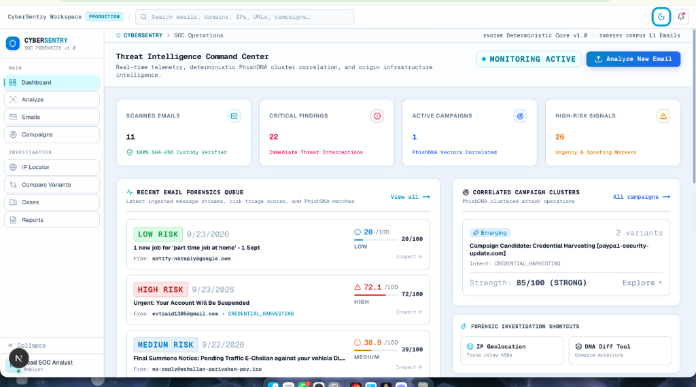
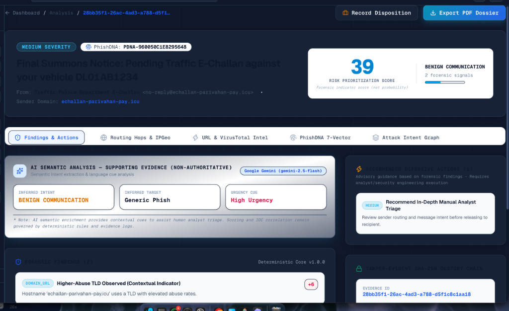
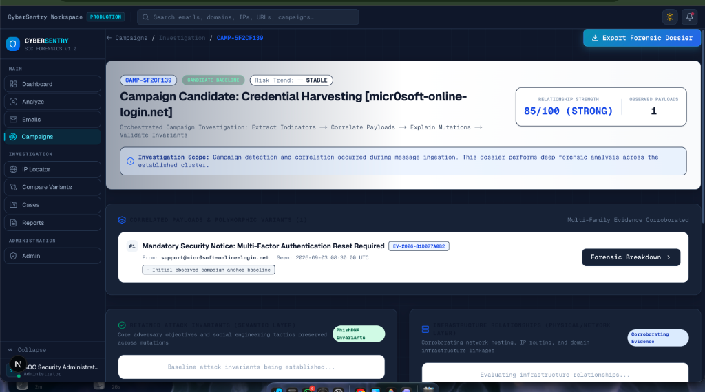
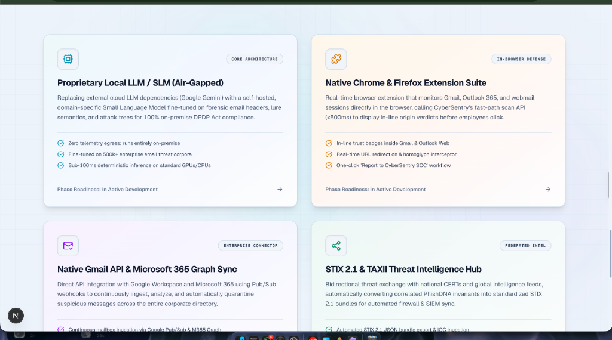

# 🛡️ CyberSentry — AI-Powered Semantic Email Forensic & Campaign Intelligence Platform

[](https://www.sih.gov.in/)
[](https://www.python.org/)
[](https://fastapi.tiangolo.com/)
[-black.svg)](https://nextjs.org/)
[](https://www.typescriptlang.org/)
[](https://tailwindcss.com/)
[](LICENSE)
[]()

> **Submission for Smart India Hackathon (Problem Statement: SIH PS 26106)**  
> *AI/ML-Powered Semantic Analysis of Phishing Emails, Campaign Tracking, and Forensic Chain-of-Custody*

---

## 📸 Platform Interface & Screenshots

### 1. Threat Intelligence Command Center (`/dashboard`)
*Real-time SOC telemetry, recent email triage queue, active campaign clusters, and quick forensic shortcuts.*


### 2. Deep Forensic Analysis & PhishDNA Dossier (`/analysis/[id]`)
*0–100 Explainable Risk Prioritization, PhishDNA™ 7-Vector Fingerprint, Google Gemini Non-Authoritative AI enrichment, and immutable SHA-256 custody trail.*


### 3. Unified Campaign Investigation (`/campaigns/[id]`)
*Correlated polymorphic variants, Retained Attack Invariants (Semantic Layer) vs. Infrastructure Relationships (Physical Layer), and IOC blocklists.*


### 4. Modular Core Architecture & Future Roadmap
*Air-gapped Local SLM / LLM fallback, Native Browser Extension Suite, Gmail API / M365 Graph sync, and STIX 2.1 Threat Intel Hub.*


---

## 📑 Table of Contents
1. [Executive Summary & Problem Statement](#-executive-summary--problem-statement)
2. [Key Capabilities & Technical Highlights](#-key-capabilities--technical-highlights)
3. [Unified Campaign Investigation Architecture](#-unified-campaign-investigation-architecture)
4. [Scientific Precision & Defensible Architecture](#-scientific-precision--defensible-architecture)
   - [PhishDNA™ Normalized Semantic Feature Vector](#1-phishdna-normalized-semantic-feature-vector)
   - [5-Factor Similarity Scoring & Hard-Negative Rejection Gate](#2-5-factor-similarity-scoring--hard-negative-rejection-gate)
   - [Attack Invariants vs Infrastructure Relationships](#3-attack-invariants-vs-infrastructure-relationships)
   - [India DPDP Act Compliance & PII Sanitization](#4-india-dpdp-act-compliance--pii-sanitization)
   - [Heuristic Risk Triage vs Statistical Probability](#5-heuristic-risk-triage-vs-statistical-probability)
   - [Tamper-Evident SHA-256 Custody Chain](#6-tamper-evident-sha-256-custody-chain)
5. [System Architecture & Directory Structure](#-system-architecture--directory-structure)
6. [Quickstart & Local Development](#-quickstart--local-development)
7. [Default Credentials & Role-Based Access](#-default-credentials--role-based-access)
8. [Automated Test Suite (97 Tests)](#-automated-test-suite-97-tests)
9. [Step-by-Step Evaluation Walkthrough](#-step-by-step-evaluation-walkthrough)
10. [Pushing to GitHub Organization](#-pushing-to-github-organization)

---

## 🎯 Executive Summary & Problem Statement

### The Problem (SIH PS 26106)
Traditional Secure Email Gateways (SEGs) and spam filters rely primarily on static reputation blacklists, basic header checks (SPF/DKIM/DMARC pass/fail), and keyword filters. When sophisticated threat actors launch **polymorphic phishing campaigns**, execute **Business Email Compromise (BEC)** using display-name spoofing, or register **fresh lookalike domains**, legacy defenses fail:
- **"Unknown" is Treated as "Safe"**: Newly registered domains (NRDs) with zero blacklist history bypass reputation checks.
- **Single-Email Bias**: Traditional tools analyze each message in isolation, completely missing multi-target coordinated campaigns.
- **Surface Indicator Vulnerability**: When attackers alter sender names, mailboxes, URLs, and subjects across iterations, traditional similarity scores drop to zero.
- **Black-Box AI / Lack of Legal Admissibility**: Generic LLM wrappers produce unverified summaries lacking mathematical auditability, cryptographic custody chains, or explainability.

### The Solution: CyberSentry
CyberSentry is a **tamper-evident forensic investigation and campaign intelligence platform** engineered for Security Operations Center (SOC) analysts, CERT-In responders, and forensic investigators. It ingests raw RFC 5322 `.eml` payloads, guarantees evidence integrity via SHA-256 custody chains, calculates an explainable 0–100 heuristic risk score, extracts multi-dimensional **PhishDNA™** normalized feature vectors, automatically clusters polymorphic variants into unified campaigns using 5-factor independent evidence families, and highlights surface evasion techniques through a structured **"What Changed?"** differential analysis engine.

---

## ⚡ Key Capabilities & Technical Highlights

- **Deterministic Core Forensic Engine**: 100% offline, zero-dependency parsing of RFC 5322 MIME headers, Received hop traversal, homoglyph evaluation, and SPF/DKIM/DMARC authentication analysis.
- **PhishDNA™ 7-Vector Normalization**: Generates an invariant structural and behavioral fingerprint resistant to surface modifications.
- **5-Factor Campaign Correlation**: Automatic clustering based on semantic intent, target brand, infrastructure CIDR subnet, HTML DOM structure, and authentication signals.
- **Interactive SVG Attack Intent Graph**: Visualizes adversary infrastructure, origin hops, landing domains, and targets with zoom, pan, and full-screen inspection.
- **IPGeolocation.io Live Enrichment**: Enriches relay hop IPs with country flags, ISP/ASN, geographic coordinates, and OpenStreetMap integration.
- **VirusTotal v3 Multi-Engine Scanning**: Live cross-referencing of extracted domains and landing URLs across 90+ antivirus vendors.
- **India DPDP Act Compliance**: Client-side and server-side automated masking of Indian PII (Aadhaar, PAN, Indian Mobile, UPI IDs, IFSC codes) before any LLM inference or external export.
- **Kaggle Phishing Dataset Integration**: Pre-indexes over 100,000+ real-world verified malicious URLs and domains for instant correlation.
- **Adaptive Low-Dim Theme**: Seamless, flicker-free switching between low-dim Dark Mode and Oceanic Light Mode with tailored pastel accents.

---

## 🔬 Scientific Precision & Defensible Architecture

In compliance with forensic rigor, CyberSentry enforces strict, defensible standards:

### 1. PhishDNA™ Normalized Semantic Feature Vector
PhishDNA is not a black-box machine learning embedding. It is a **deterministic normalized semantic feature vector & structural/behavioral fingerprint**:
- **Layer 1: Exact Forensic Indicators (Ground Truth)**  
  Captures exact sender addresses, canonical domains, observed MTA relay IPs, and attachment SHA-256 digests.
- **Layer 2: Normalized Semantic Feature Vector & Structural Abstractions**  
  Maps the message into normalized feature spaces:
  - *Semantic Intent*: Credential Harvesting, Payment Redirection, MFA Manipulation, Executive Impersonation, Invoice Fraud, Benign.
  - *Social Engineering Strategy*: Account Suspension Fear, Policy Compliance Urgency, Authority Pressure, Financial Penalty Avoidance.
  - *Action Request*: Credential Verification, Token Synchronization, Wire Transfer, Confidential Task Execution.
  - *Structural HTML Fingerprint*: Jaccard similarity across ordered HTML structural tag n-grams.
  - *Network CIDR Routing*: Subnet prefix matching (`/24` network mask).

### 2. 5-Factor Similarity Scoring & Hard-Negative Rejection Gate
Similarity between email payloads is calculated via an explicit 5-factor weighted model:
- **Semantic Intent & Target Alignment**: 40% (Intent, target brand, psychological strategy)
- **URL & Domain Canonical Match**: 25% (Landing hosts, path patterns, query structures)
- **Infrastructure & Network (/24 Subnet)**: 20% (Origin IPs, /24 subnet segments as corroborating evidence)
- **HTML DOM & Structural Layout**: 10% (Tag sequences, layout framing)
- **Authentication Alignment**: 5% (SPF/DKIM/DMARC reported failure modes)

**Hard-Negative Rejection Gate**: Legitimate corporate notices (e.g., urgent IT security alerts with valid authentication and corporate domains) are actively rejected from malicious campaign clusters, resulting in <20% similarity scores and zero false clustering.

### 3. Attack Invariants vs Infrastructure Relationships
CyberSentry enforces an explicit architectural separation:
- **Retained Attack Invariants**: Semantic and behavioral constants preserved by the attacker across variants (e.g., attack intent, impersonation target, social engineering pressure, requested action).
- **Infrastructure Relationships**: Technical hosting links observed in transit headers (e.g., shared `/24` subnet, shared MTA relay IP, shared registrar).
*Forensic Disclaimer*: Infrastructure relationship does not constitute legal or physical proof of attacker identity.

### 4. India DPDP Act Compliance & PII Sanitization
Under the Digital Personal Data Protection (DPDP) Act, personal identifiers must never be transmitted to third-party cloud APIs without explicit masking. CyberSentry implements deterministic regex filters for:
- **Aadhaar Numbers**: `XXXX-XXXX-1234`
- **PAN Cards**: `ABCDE****F`
- **Indian Mobile Numbers**: `+91-XXXXX-12345`
- **UPI IDs & VPA**: `user****@okhdfcbank`
- **Bank IFSC Codes**: `HDFC0****`

### 5. Heuristic Risk Triage vs Statistical Probability
- The 0–100 Risk Prioritization Score is an operational triage metric derived from weighted forensic indicators (display-name spoofing, lookalike domains, reported auth failure, urgent wire CTA).
- It is **not** a statistical probability of malice. Clean baseline emails receive clear guidance stating: *"No high-priority hostile indicators detected by current analysis engines."*
- All recommended actions are explicitly **Advisory Defensive Guidance** requiring analyst review.

### 6. Tamper-Evident SHA-256 Custody Chain
Evidence custody is tracked through an append-only, tamper-evident SHA-256 hash log (`INGESTED` ➔ `PARSED` ➔ `ANALYZED` ➔ `VIEWED` ➔ `EXPORTED` ➔ `DECISION_RECORDED`).

---

## 📁 System Architecture & Directory Structure

```
CyberSentry/
├── backend/                       # FastAPI Python Backend
│   ├── app/
│   │   ├── api/                   # REST API Endpoints (auth, analysis, campaigns, cases, reports, admin)
│   │   ├── core/                  # Security, config, database sessions, JWT tokens
│   │   ├── engines/               # Pure Deterministic Forensic Engines
│   │   │   ├── header_engine.py   # Display spoofing, MTA hop traversal, auth checks
│   │   │   ├── url_engine.py      # Homoglyphs, lookalike domains, URL authority obfuscation
│   │   │   ├── intent_engine.py   # Lure semantics & urgency profiling
│   │   │   ├── phishdna_engine.py # 7-Vector feature extraction & 5-factor similarity
│   │   │   ├── campaign_engine.py # Multi-family clustering & activity state machine
│   │   │   └── risk_engine.py     # 0-100 heuristic risk scoring & defensive playbooks
│   │   ├── models/                # SQLAlchemy ORM models (AuditLog, Email, Analysis, Case, etc.)
│   │   ├── providers/             # LLM & External Intel Integrations (Gemini, VirusTotal, IPGeo)
│   │   ├── schemas/               # Pydantic validation schemas
│   │   └── services/              # Business logic (Detection, Evidence, Campaign, PDF, Reports)
│   ├── tests/                     # 97 Automated Pytest Test Suite
│   └── requirements.txt           # Python backend dependencies
│
├── frontend/                      # Next.js 16 (Turbopack) + Tailwind CSS
│   ├── src/
│   │   ├── app/                   # App Router Pages (dashboard, analyze, campaigns, emails, etc.)
│   │   ├── components/            # UI Components, Theme Provider, Topbar, Sidebar, Charts
│   │   │   ├── graph/             # Attack Intent SVG Graph Component
│   │   │   ├── landing/           # Interactive Threat Intel & Roadmap Visualizations
│   │   │   └── shell/             # AppShell, Topbar, Sidebar navigation
│   │   ├── lib/                   # API client, Auth Context, Cookie handling
│   │   └── types/                 # TypeScript interfaces and API schemas
│   └── package.json               # Frontend dependencies & Next.js config
│
├── data/
│   ├── rules/                     # Indian brands & lure YAML rules
│   ├── synthetic/                 # Evaluation dataset (6 realistic synthetic .eml samples)
│   └── threat-intel/              # Seed indicators & Kaggle phishing URLs dataset (32MB)
│
├── docs/                          # Architecture, TRD, PRD, and screenshots
│   └── screenshots/               # High-resolution platform captures
├── docker-compose.yml             # Full-stack container orchestration
├── .env.example                   # Backend environment configuration template
└── README.md                      # Primary project documentation
```

---

## 🚀 Quickstart & Local Development

### Option 1: Local Development

#### Prerequisites
- **Python 3.11+**
- **Node.js 18+** and `npm`
- **Git**

#### 1. Backend Setup
```bash
# 1. Create and activate Python virtual environment
python3 -m venv backend/venv
source backend/venv/bin/activate  # On Windows: backend\venv\Scripts\activate

# 2. Install backend dependencies
pip install -r backend/requirements.txt

# 3. Seed database with default accounts, threat intel, and synthetic campaign samples
PYTHONPATH=. python3 -m backend.app.seed

# 4. Start FastAPI backend (Runs on http://localhost:8000)
PYTHONPATH=. uvicorn backend.app.main:app --host 0.0.0.0 --port 8000 --reload
```

#### 2. Frontend Setup
In a separate terminal window:
```bash
# 1. Navigate to frontend directory
cd frontend

# 2. Install dependencies
npm install

# 3. Start Next.js development server (Runs on http://localhost:3000)
npm run dev
```

Open **[http://localhost:3000](http://localhost:3000)** in your browser.

---

### Option 2: Docker Compose (Full Stack)

```bash
docker compose up --build
```
- **Frontend Application:** `http://localhost:3000`
- **Backend API & Interactive Swagger Docs:** `http://localhost:8000/docs`

---

## 🔐 Default Credentials & Role-Based Access

| Role | Email | Password | Capabilities |
| :--- | :--- | :--- | :--- |
| **Lead SOC Analyst** | `analyst@cybersentry.local` | `Analyst@CyberSentry123!` | Ingestion, Triage, Case Management, Campaign Investigation, Diffing, PDF Export |
| **SOC Administrator** | `admin@cybersentry.local` | `Admin@CyberSentry123!` | Full System Control, User Management, Threat Intel Ingestion, Retention Enforcement |

*(Note: The login page includes convenient one-click demo fill buttons for rapid evaluation)*

---

## 🧪 Automated Test Suite (97 Tests)

Run the comprehensive pytest suite verifying pure deterministic engines, API routes, authentication, IP geolocation, VirusTotal handling, Indian PII masking, and campaign correlation:

```bash
PYTHONPATH=. pytest backend/tests -v
```

**Verification Results:**
```
============================== 97 passed in 4.05s ==============================
```

---

## 🎬 Step-by-Step Evaluation Walkthrough

1. **Ingest Baseline Phishing Sample (`sample_01`)**:
   - Go to `/analyze` and upload `data/synthetic/sample_01_credential_phish_paypal.eml`.
   - Observe **CRITICAL (94/100)** score, display-name spoofing flag, and generated PhishDNA signature.
2. **Ingest Mutated Variant (`sample_02`)**:
   - Upload `data/synthetic/sample_02_credential_phish_paypal_variant.eml`.
   - Observe automatic clustering into the **PayPal Credential Phishing** campaign cluster (>85% similarity).
3. **Explore Campaign Investigation (`/campaigns/[id]`)**:
   - Inspect the Retained Attack Invariants vs. Infrastructure Relationships breakdown.
   - View the **Variant Diff Engine** highlighting what mutated vs. what remained constant.
4. **Inspect Interactive Attack Graph**:
   - Open the **Attack Intent Graph** tab on the analysis page to view multi-hop origin routing and landing nodes.
5. **Verify Hard-Negative Gate**:
   - Ingest `data/synthetic/sample_06_hard_negative_security_notice.eml` (Legitimate internal IT alert).
   - Observe that despite urgent vocabulary, it receives a **LOW** score and is **never** correlated into malicious clusters.
6. **Export Cryptographic PDF Dossier**:
   - Click **"Export PDF Dossier"** on any analysis to generate an immutable report complete with SHA-256 custody chain and non-authoritative AI labels.

---

## 📤 Pushing to GitHub Organization

To push this project to your newly created GitHub Organization repository, run the following commands from the project root:

```bash
# 1. Initialize git (if not already initialized)
git init

# 2. Stage all cleaned and organized files
git add .

# 3. Commit the initial release
git commit -m "feat: CyberSentry v1.0.0 — AI Semantic Email Forensic & Campaign Intelligence Platform"

# 4. Set default branch to main
git branch -M main

# 5. Add your GitHub Organization remote (Replace with your actual repo URL)
git remote add origin https://github.com/YOUR_ORGANIZATION_NAME/CyberSentry.git

# 6. Push to GitHub
git push -u origin main
```

---

## 👥 Smart India Hackathon (SIH PS 26106)
Built with scientific precision, mathematical auditability, and legal defensibility for **Smart India Hackathon**.
